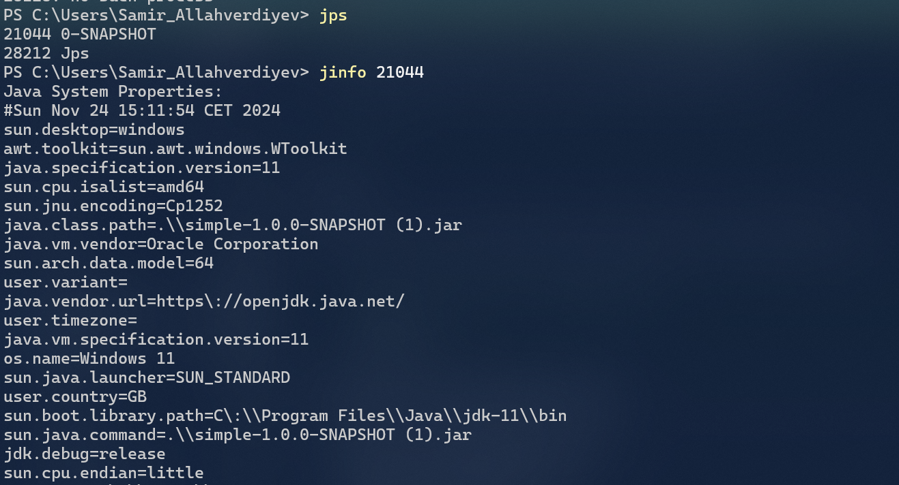

- Which interface JDK tools use to connect to JVM locally?
   JVMTI(native interface) and JMX

- What is difference between profiling and traceability?
    Profiling is measuring CPU usage, memory consumption, etc.
  Traceability is tracking the flow of requests.

-----
- Observed heap-1.0.0-SNAPSHOT.jar heap consumption via jvisualvm

-----
- Found the reason of leak in heap-1.0.0-SNAPSHOT.jar via jvisualvm
   Limitless Strings were added to list in HeapMain.class

-----
- OQL queries were executed in jvisualvm

-----
- Printed Thread.dump via jstack

- Remote JVM profilling via Jconsole

-----
- Connected to Hotspot of JVM via JMC

-----
- Printed the properties via jinfo

